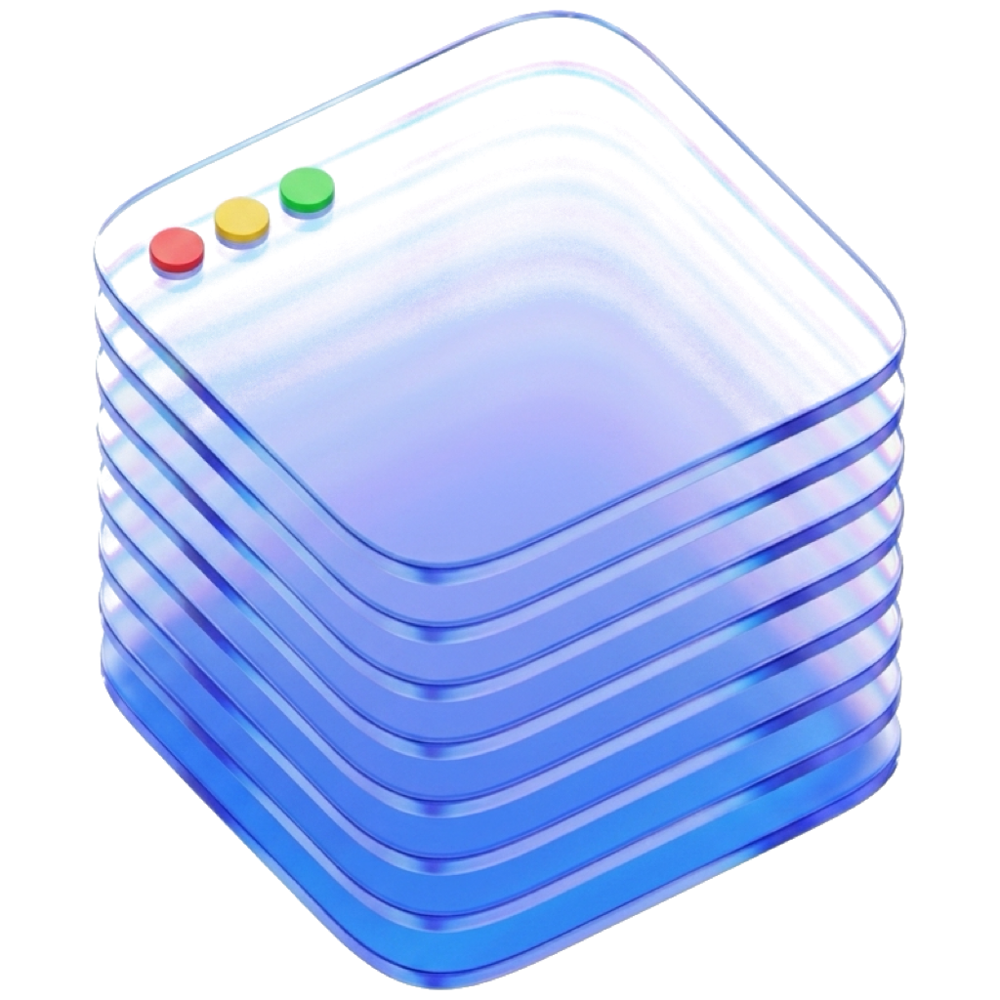

<div align="center">



# RememberMyWindows

**A native macOS app that remembers where your windows were — and puts them back.** [Features](#-features) · [Installation](#-installation) · [How it works](#️-how-it-works) ·  [Contributing](#-contributing) 

[](https://www.apple.com/macos/) [](https://swift.org) [](https://www.gnu.org/licenses/gpl-3.0)

</div>

---

## ✨ What it does

Every time you plug in a monitor, disconnect from a dock, or rearrange your displays — your windows end up in the wrong place. **RememberMyWindows** fixes that.

It silently tracks your window positions in the background, and the moment it recognises your display setup, it puts every window exactly where you left it.


---

## 🚀 Features

| Feature | Description |
|---|---|
| 🖥️ **Screen Fingerprinting** | Identifies every display by hardware ID — layouts are tied to your exact physical monitors |
| 💾 **Auto-Save** | Records window positions as you move or resize them (800ms debounce, no disk spam) |
| ♻️ **Auto-Restore** | When a known display configuration reconnects, your saved layout is applied automatically |
| 🏷️ **Named Layouts** | Create, rename, and manage multiple layouts per screen configuration |
| ⌨️ **Quick Restore Shortcut** | Trigger a restore instantly with a keyboard shortcut |
| 🔔 **Notch Notifications** | Subtle notch-style alerts keep you informed without interrupting your flow |
| 📋 **Live Activity Log** | See every tracking event in real time |
| 🌙 **Dark Mode & Themes** | Fully native, looks great in light and dark mode |
| 🌍 **English & Hebrew** | Fully localised UI with automatic language detection |

---

## 📋 Requirements

- **macOS 15.0 (Sequoia)** or later
- **Xcode 16+** (to build from source)

---

## 🔧 Installation

```bash
# 1. Clone the repository
git clone https://github.com/netanel3000fine/RememberMyWindow.git
cd RememberMyWindow

# 2. Open the Xcode project
open WindowLayout/RememberMyWindows.xcodeproj
```

Then in Xcode:
1. Select your **Development Team** under *Signing & Capabilities*
2. Press **⌘R** to build and run

Or just download the latest DMG file 

### Required Permissions

On first launch, the app will prompt you for the following:

| Permission | Why it's needed |
|---|---|
| **Accessibility** | To read and move windows in other apps *(System Settings → Privacy & Security → Accessibility)* |
| **Automation / Apple Events** | Granted automatically on first use when restoring another app's window |

> ℹ️ **Note:** Permissions can be revoked at any time in *System Settings → Privacy & Security*.

---

## 🏗️ How it works

### Screen Fingerprinting
Each physical display has a unique `NSScreenNumber`. RememberMyWindows combines all connected screen IDs and resolutions into a fingerprint key:

```
12345678@2560x1600+87654321@2560x1440
```

When your displays change, a new key is computed and matched against your saved layouts.

### Window Capture
Uses `CGWindowListCopyWindowInfo` to snapshot all visible windows across all apps. Tiny utility windows under 50px are automatically ignored to keep the log clean.

### Coordinate System
- `CGWindowList` uses a **top-left** origin
- `AppKit / NSWindow` uses a **bottom-left** origin
- RememberMyWindows converts between them automatically using the primary screen height

### Restoring Other Apps
Window positions in third-party apps are restored via AppleScript:

```applescript
tell application "AppName"
    set bounds of front window to {x, y, x2, y2}
end tell
```

---

## 📁 Project Structure

```
RememberMyWindow/
├── LICENSE                         ← GPLv3
├── README.md                       ← You are here
├── Build-RememberMyWindows.sh      ← Build script
├── DMG-BuildandPackage.sh          ← DMG packaging script
└── WindowLayout/                   ← All source code
    ├── RememberMyWindows.xcodeproj
    ├── RememberMyWindowsApp.swift  ← App entry point
    ├── WindowManager.swift         ← Core tracking, save & restore engine
    ├── ScreenFingerprint.swift     ← Display config identification
    ├── WindowRecord.swift          ← Data models
    ├── ContentView.swift           ← Main navigation shell
    ├── LayoutsView.swift           ← Saved layouts browser
    ├── SettingsView.swift          ← Preferences panel
    ├── ActivityView.swift          ← Live event log
    ├── NotchNotification.swift     ← Notch-style alerts
    ├── ThemeManager.swift          ← Theme system
    ├── Localization.swift          ← String localisation helpers
    ├── Sounds/                     ← Notification sounds
    ├── en.lproj/                   ← English strings
    └── he.lproj/                   ← Hebrew strings
```

---

## 💾 Data Storage

Window layouts are saved locally to:

```
~/Library/Application Support/RememberMyWindows/layouts.json
```

No data ever leaves your Mac. 📴

---

## ⚠️ Known Limitations

- **Background windows:** AppleScript can only restore the **frontmost window** of each app. Background windows require the app to be focused first.
- **Sandboxed apps:** Some Mac App Store apps may reject Apple Events for security reasons.
- **Multi-window restore:** Precise control over every window in every app could be achieved with `AXUIElement` (the Accessibility API) — a possible future enhancement (see comments in `WindowManager.swift`)

---

## 🗺️ Roadmap

- [ ] Restore **all** windows per app using the Accessibility API (`AXUIElement`)
- [ ] Menu bar quick actions
- [ ] Export / import layouts between Macs

---

## 🤝 Contributing

Contributions are very welcome! This project is licensed under **GPLv3**, which means:

- ✅ You can fork, modify, and redistribute
- ✅ Your contributions stay open-source
- ❌ You cannot redistribute closed-source or proprietary versions

Please open an **Issue** to discuss a bug or feature before submitting a **Pull Request**.

> 💬 *Note: New interface strings should be submitted in English — the author will add Hebrew translations.*

---

## 📄 License

RememberMyWindows is licensed under the **GNU General Public License v3.0**.
See [LICENSE](LICENSE) for the full text.

---

<div align="center">
Made with ❤️ by <a href="https://github.com/netanel3000fine">Netanel</a>
</div>
